# Deep Dive: LLMs are an I/O Layer

LLMs are extraordinary at moving between representations of text — parsing ambiguous natural language into structured data, generating fluent prose from structured data, summarizing, translating, reformatting. They are not calculators. They are not classifiers. They are not databases. The architecture of any LLM-based system should reflect this, and most production systems that work reliably have converged on the same pattern — sometimes by design, usually by pain.

The pattern: use LLMs for parsing ambiguous input and writing fluent output. Use deterministic code for arithmetic, classification, persistence, and consistency. Put a thick deterministic layer between them, and structure-lock every boundary.

Everything below is mechanism.

---

## The monolithic instinct

Consider a small business that needs to track employee travel for regulatory compliance — counting days spent in various jurisdictions against statutory thresholds. The data is structured (flights, dates, locations), the rules are deterministic (day-count arithmetic, threshold comparisons, projection logic), but the user interface is natural language. An operations manager types "Priya flew to Chicago March 3 to March 14, then DC through the 20th" and expects the system to log those trips, update the counts, and flag any compliance risk.

The obvious architecture: hand the LLM a playbook covering every rule and edge case, and let it handle the full pipeline — parse the input, figure out the intent, run the numbers, compose the response. 

In practice, this approach gets roughly half the cases right. And the failures are more instructive than the successes.

### Failure anatomy

| Input | What happened | Root cause |
|---|---|---|
| "Priya flew to Chicago via Atlanta" | Wrote the confirmation as plain text instead of calling the structured confirmation tool | Routing failure — model chose to respond directly instead of invoking the tool chain |
| "What's the impact of adding a London trip?" | Reported a buffer of +207 days when the correct answer was +167 | Arithmetic failure — the model hallucinated a number instead of computing it |
| "Show me Mike's current status" | Paraphrased the pre-formatted status output into freeform bullets | Rendering failure — model rewrote content it should have passed through verbatim |
| "When was Chanel's last in London?" | Answered from general context, skipping the person-resolution step entirely | Sequencing failure — model skipped a required intermediate tool call |

Four failures, four different root causes. But the critical problem is upstream of any individual failure — when one component does four jobs, the failure modes are inseparable. A wrong output could be a parsing error, a routing error, a computation error, or a rendering error, and there is no way to tell from the output alone. The system has no diagnostic surface.

The instinct here is to make the prompt longer — add more emphasis, bold the critical rules, repeat them. But a 13KB prompt that fails on half the cases won't become reliable at 20KB. The model is being asked to satisfy four distinct sets of instructions inside a single forward pass, and it trades attention between them unpredictably. The problem isn't clarity of instruction — it's instruction density.

The solution is less LLM, not more prompt.

---

## The recommended architecture: extract → compute → render

The architecture I recommend decomposes the pipeline into three stages, each with a single responsibility and a distinct failure mode.



**Extract** — the LLM parses natural language into structured data. "Priya flew to Chicago March 3 to March 14" becomes `{person: "Priya", flights: [{dest: "ORD", depart: "2025-03-03", return: "2025-03-14"}]}`. The only failure mode here is a malformed or incomplete extraction, which is easy to validate against a JSON schema.

**Compute** — deterministic code applies the business rules. Day-count arithmetic, threshold comparisons, projection logic, database lookups. No LLM involvement. The failure mode is a bug in the code — which is reproducible, unit-testable, and fixable.

**Render** — the LLM writes prose around the pre-computed results. It receives a JSON payload containing every number it needs, and its only job is to compose a natural-language response that presents those numbers clearly. The failure mode is bad prose or — critically — hallucinated numbers, which the validation layer catches (more on this below).

The LLM is allowed to parse natural language and write prose. It is forbidden from doing math, date arithmetic, classification logic, or persistence. Deterministic code handles all of that, forming a thick boundary layer between extract and render.

The constraint cuts both ways — deterministic code cannot parse "Susan flew to Chicago via Atlanta, back on the 15th." There is genuine ambiguity in that sentence: the 15th of which month? Is "via Atlanta" a layover or a destination? Resolving that ambiguity is what LLMs are uniquely good at. And deterministic code cannot write "You're 23 days over the threshold — here's what that means for Q3" in a way that reads naturally. That is also what LLMs are good at.

The thick deterministic layer between extract and render is where correctness lives.

---

## Why single-layer orchestration breaks down

Three-stage separation is the right decomposition, but implementing it as a single LLM that calls tools in sequence still fails — for a subtler reason than the monolithic approach.

The failure mode is stage-bleeding. A single LLM managing the full pipeline is constantly tempted to merge stages. It sees the extracted data and starts computing with it instead of calling the compute tool. It gets compute results back and starts editorializing instead of calling the render tool. It receives render output and paraphrases it instead of passing it through verbatim. The three-stage design exists in the prompt, but the model doesn't respect the boundaries because it has access to everything at once.

In the employee travel system, this manifested as the orchestrator receiving a pre-formatted compliance status — complete with day-counts, thresholds, and buffer calculations — and rewriting it into a bulleted summary. The numbers in the summary were wrong. Not because the compute layer was wrong, but because the LLM re-derived them from the raw data instead of quoting the render output.

The deeper issue: stage-bleeding is undetectable at the prompt level. The model appears to be following instructions — it called the right tools, it produced reasonable-looking output. But it silently performed computation inside what should have been a pure routing step, and the numbers drifted.

## The recommended architecture: two-layer orchestration

The fix is to split the LLM into two layers with an enforced separation of concerns.



**The orchestrator** has a ~1.2KB prompt. Its output is constrained — via the API's structured-output mode — to tool calls only. It cannot, by construction, emit free prose. It decides which tool to call next, passes input, receives output, and decides the next tool call. That is the entirety of its job.

**The tool tier** contains two kinds of tools. Inner LLM tools handle extraction and rendering — each with a small, schema-locked prompt targeting exactly one task. Compute tools are pure deterministic code — no LLM involvement, fully unit-tested.

This eliminates stage-bleeding by construction. The orchestrator cannot editorialize because its output format forbids prose. It cannot compute because it has no access to the business logic — only the compute tools do. It cannot re-derive numbers because it never sees the raw data, only the tool outputs. Each inner LLM tool operates on a narrow slice of the problem — a 500-character prompt for one extraction or one rendering task — which leaves far less surface area for off-task improvisation.

The architectural constraint is simple: the orchestrator is a router, not a thinker. Every user-facing response originates from a render tool and passes through the orchestrator unmodified.

---

## Schema-locked extraction

Each extraction tool gets a small prompt targeting exactly one job, returning a fixed JSON schema:

```
extract_log_intent     — NL → {flights: [...], needs_clarification: bool}
extract_inquiry_intent — NL → {kind: "status"|"projection"|"impact", args: {...}}
extract_history_intent — NL → {kind: "last_visit"|"search", args: {location, ...}}
extract_modify_intent  — NL → {op: "update"|"delete", target_filter, change}
```

Each prompt is ~500 characters. Downstream code validates the output shape against the schema — it rejects anything that doesn't conform.

The improvement over a single mega-prompt is significant. When an inner LLM only has to extract dates and locations from a sentence — not also decide what to do with them, compute day counts, and compose a reply — it does that one job with much higher reliability. The narrower the extraction task, the more attention the model can dedicate to the tokens that matter. A model attending to date-extraction tokens is not simultaneously attending to instructions about confirmation formatting or arithmetic rules.

---

## Loose number validation

The single most useful pattern in this architecture — ten lines of code that catch the most expensive class of failure.

```python
import json
import re

def find_digit_runs(text):
    return re.findall(r'\d{3,}', text)

def validate_render(prose, input_json):
    """Every digit run (3+ chars) in prose 
    must appear in the input JSON."""
    haystack = json.dumps(input_json)
    return [
        run for run in find_digit_runs(prose)
        if run not in haystack
    ]
```

After every render tool produces prose, this validator checks whether every significant number in the output actually exists in the input data. If the compute layer returned `+167` and the render LLM wrote `+207`, the validator catches it before the response reaches the user.

The "loose" qualifier matters — substring match on digit runs of three or more characters, which ignores years, short counts, and incidental numbers. The check catches hallucinated arithmetic without constraining the prose. The LLM writes whatever sentence structure it wants, as long as every quoted number traces back to the input.

---

## Deterministic fallback

Every render tool has a three-tier output strategy:



```python
def render_with_fallback(system_prompt, json_input, template_fn):
    # Tier 1: LLM renders fluent prose
    prose = inner_llm_call(system_prompt, json_input)
    if not validate_render(prose, json_input):
        return prose

    # Tier 2: retry with stricter instructions
    strict = system_prompt + STRICT_SUFFIX
    prose = inner_llm_call(strict, json_input)
    if not validate_render(prose, json_input):
        return prose

    # Tier 3: deterministic template — never wrong
    return template_fn(json_input)
```

The system never surfaces hallucinated numbers. If the LLM is unreachable, slow, or hallucinating, quality degrades — the deterministic template reads like a robot wrote it — but correctness does not. The design principle: the LLM is optional for correctness, never optional for usability. Remove it entirely and the system still works. Add it back and the system sounds better — but the numbers don't change.

---

## Canary tokens

The orchestrator must pass render output to the user verbatim — no paraphrasing, no reformatting. Verifying this in a test harness requires a mechanism to detect silent modification.

The approach: embed a canary string in the render output and assert that it survives the full pipeline.

```
Here is your current status: CANARY-9K2M
  Qualifying days: 142 of 200
  Buffer remaining: +58
```

If the canary appears in the final user-facing message, the orchestrator passed the output through correctly. If it doesn't, the orchestrator paraphrased — which means numbers may have drifted — and the test catches the regression.

One implementation detail that matters: canary placement. A canary on a leading line is likely to be stripped as metadata — models are trained to ignore header-like content. Burying the canary mid-prose ensures that removing it would break the semantic content, which forces the orchestrator to preserve it.

---

## Patterns worth naming

The architecture decomposes into six named patterns, each addressing a specific failure mode:

1. **Three-stage separation** — extract → compute → render. Each stage has a distinct, diagnosable failure mode.
2. **Two-layer orchestration** — the router LLM never writes prose. Tool-tier LLMs do narrow, schema-locked jobs.
3. **Schema-locked extraction** — small focused prompts targeting one extraction each, returning fixed JSON schemas validated downstream.
4. **Loose number validation** — cheap substring check that catches hallucinated arithmetic before it reaches the user.
5. **Deterministic fallback** — every render has a code template safety net. Correctness never depends on the LLM.
6. **Canary tokens** — verify verbatim quoting across tool boundaries by embedding traceable strings mid-prose.

---

## Connecting to the broader picture

As argued in [the Intelligence Series](/tags/intelligence-series/) — particularly *Intelligence Is Compression, Not Experience* — training a large language model is itself a compression process: trillions of tokens of training data get reduced to billions of weights, with the weights encoding the statistical regularities of language as a learned function. That compressed model of language is what makes LLMs good at the two operations this essay relies on — transforming ambiguous natural-language input into a target structured format, and transforming structured input into fluent natural-language output. Note what was *not* part of what they compressed: rules for arithmetic, mechanisms for persistence, guarantees of consistency. Asking the inference-time model to perform those operations is asking it to do work the training process never optimized for.

The three-stage architecture is a direct expression of that understanding. The LLM handles the two tasks it excels at — extraction and rendering — and deterministic code handles everything between. The thick boundary layer is not a workaround for LLM limitations. It is an architectural recognition of what these systems actually are, and what they are not.

Every production LLM system that works reliably has converged on some version of this pattern. The ones that don't are still trying to make the prompt longer.
